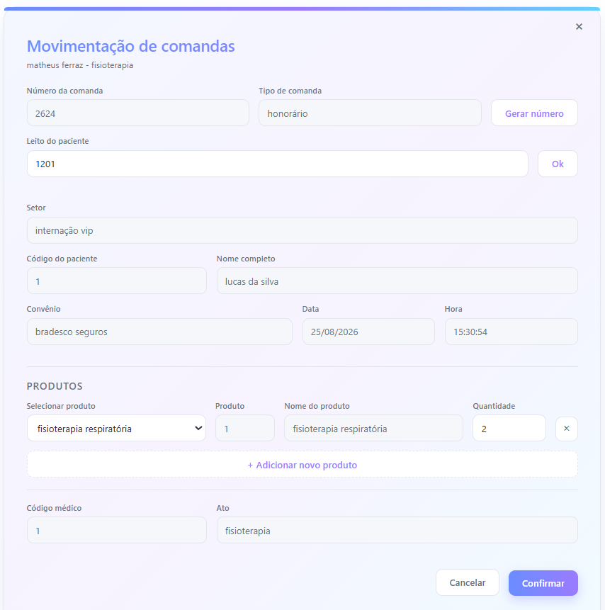

# Sistema de Faturamento Hospitalar Automatizado

Trabalho com faturamento hospitalar e o sistema que usamos é legado: quase tudo é digitado à mão,
campo por campo, comanda por comanda. Percebi que a maior parte desse trabalho manual é
**informação que o próprio sistema já tem** — o leito sabe quem é o paciente, o login sabe quem é
o funcionário, o produto tem código próprio. Só não estava conectado.

Este projeto é a minha proposta de como esse fluxo poderia funcionar: mesma regra de negócio,
mesmas informações, mas com o sistema preenchendo tudo que ele já é capaz de deduzir.
Não foi implantado no trabalho (o sistema de lá é legado e envolve muito mais coisa) — foi
construído em casa como projeto, a partir de um problema real que observei.



---

## O ganho: sistema antigo x sistema projetado

O que eu contei foram as **ações do funcionário para faturar uma comanda** — cada campo digitado
à mão, cada `Tab` para "acordar" um campo, cada clique.

| Etapa | Sistema antigo | Sistema projetado |
|---|---|---|
| Número da comanda | gerado sozinho | gerado sozinho |
| Tipo de comanda (honorário) | digitado | preenchido junto com o número |
| Leito | digitado | digitado *(única digitação que sobrou)* |
| Setor | digitado de cabeça | vem do leito |
| Nome do paciente | digitado | vem do leito |
| Código do paciente | digitado | vem do leito |
| Convênio | `Tab` para aparecer | vem do leito |
| Data e hora | `Tab` para aparecer | vem do leito |
| Produto | **código decorado**, digitado | seleciona pelo nome, o código aparece |
| Quantidade | digitada | setinhas, sem teclado numérico |
| Código médico | digitado | vem do login |
| Ato (cargo) | digitado | vem do login |

O número da comanda já era automático no sistema antigo — é o único campo que os dois têm em
comum. Todo o resto era trabalho do funcionário.

**Comanda com 1 produto:** 11 ações manuais → **3**. Redução de **~73%**.
**Contando só o que precisa ser digitado:** 9 campos → **1** (o leito). Redução de **~89%**.

### O detalhe que mais pesa: comandas com vários produtos

No sistema antigo, cada produto adicional obrigava a repetir **produto + código médico + ato +
quantidade** — 4 campos de novo, toda vez. Aqui, "adicionar novo produto" abre só a linha do
produto: código médico e ato ficam onde estão, porque não mudam.

| Produtos na comanda | Antigo | Projetado | Redução |
|---|---|---|---|
| 1 | 11 ações | 3 | 73% |
| 3 | 19 ações | 7 | 63% |
| 5 | 27 ações | 11 | 59% |

O custo de cada produto extra cai de **4 campos digitados para 2 cliques**.

### Os dois insights que considero mais relevantes

**1. O erro caro não era a digitação, era o código decorado.**
No sistema antigo o funcionário precisava lembrar o código do produto. Quem não lembrava,
perguntava, consultava ou chutava — e código errado no faturamento não vira só retrabalho, vira
comanda incorreta. Trocar "digite o código" por "escolha o nome e o código aparece" não deixa
essa classe de erro mais rara: **elimina ela**, porque o campo passa a ser preenchido pelo banco,
não pela memória de quem fatura.

**2. Automação aqui não é inteligência, é ligação de dados.**
Nenhum campo automático deste projeto exige algo sofisticado — é `JOIN` e sessão de login. Os 89%
de digitação que sumiram já existiam guardados no banco. O trabalho manual do sistema antigo
existia por falta de conexão entre tabelas, não por falta de informação.

---

## Stack

| Camada | Tecnologia |
|---|---|
| Backend | Python + FastAPI (API REST) |
| Banco | SQLite3, com persistência em arquivo (`database/faturamento.db`) |
| Frontend | HTML, CSS e JavaScript puro (sem framework) |
| Servidor | Uvicorn |

O frontend é servido pelo próprio FastAPI: fundo branco, formulário centralizado em degradê suave —
o oposto da tela poluída do sistema original.

## Como rodar

```bash
venv\Scripts\activate
pip install fastapi uvicorn
python -m uvicorn backend.sistema_faturamento:app --reload
```

Abra: http://localhost:8000 — docs automáticas em http://localhost:8000/docs

O banco é criado e populado sozinho quando a API sobe.
Para recriar manualmente: `python database/data.py`

## Dados de exemplo

**Login** (senha `1234` para todos):

| usuário | cargo (ato) |
|---|---|
| matheus ferraz | fisioterapia |
| ricardo alves motta | enfermagem |
| mariana fernandes | médico |

**Leitos com paciente cadastrado:** 302, 507, 707, 905 e 1201

**Setores** — descobertos a partir do leito, 18 leitos cada:

| leitos | setor | | leitos | setor |
|---|---|---|---|---|
| 101–118 | CTI geral | | 701–718 | cardio intensiva |
| 201–218 | pediatria | | 801–818 | semi intensiva |
| 301–318 | internação | | 901–918 | semi intensiva |
| 401–418 | pediatria | | 1001–1018 | internação |
| 501–518 | pós operatório | | 1201–1218 | internação vip |
| 601–618 | cuidados especiais | | 1301–1318 | internação |

O 11º andar não existe: leitos 1101–1118 são recusados.
Para alterar, edite `lista_setor` em `database/data.py`, apague o `.db` e suba o servidor de novo.

## Endpoints

| método | rota | o que faz |
|---|---|---|
| POST | `/login` | valida usuário e senha, devolve código médico e ato |
| GET | `/comanda/nova` | número aleatório da comanda + tipo "honorário" |
| GET | `/paciente/{leito}` | setor, paciente, convênio, data e hora a partir do leito |
| GET | `/setores` | setores e faixa de leitos |
| GET | `/produtos` | lista de produtos |
| POST | `/comanda/confirmar` | valida a comanda e devolve sucesso (não grava) |

Faturamentos não são salvos — o objetivo do projeto é o fluxo de preenchimento, não a persistência
da comanda.

## Estrutura

```
database/data.py                 tabelas, dados de exemplo e consultas
backend/sistema_faturamento.py   API FastAPI e serve o frontend
frontend/                        index.html, style.css, app.js
```

## Próximo passo

Autenticação com JWT — quero estudar e implementar por conta própria.
